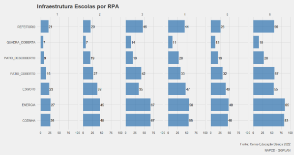

# ACOLHIMENTO EM 2022

3.417 pessoas foram atendidas por algum tipo de auxílio da PCR durante o período das fortes chuvas

19 Abrigos-Base (associações de moradores, igrejas e escolas municipais)
45 unidades de acolhimento (escolas, USFs, CRAS)

No Cenário de 2022, foi realizado o cadastro de 3417 pessoas  que foram atendidas por algum tipo de
auxílio da PCR durante o período das fortes chuvas.

Não foi possível estimar o número de atendimento médio por abrigos devido a problemas no survey realizado
em 2022.   

De maneira geral foram utilizados 19 Abrigos-Base entre associações de moradores, igrejas e escolas municipais.
E mais 45 unidades de acolhimento da SDS, sendo essas Escolas, USFs, CRAS. 

O NAPCD estima que se o survey conseguiu captar esse número de pessoas pouco tempo de aplicação, provavelmente
o número de pessoas qu precisam de abrigo seja bem maior que esse.  

Quantas pessoas em situação de risco R3 e R4 temos por RPA e quais são esses Bairros?

Recife (TOTAL R3 e R4)

2.195 pessoas (925 famílias) 

R3 1.868 pessoas
R4 327 pessoas

RPAs com maior vulnerabilidade: RPA 2, RPA 3 e RPA 6

Bairros com mais pessoas em vulnerabilidade:
RPA 2 
DOIS UNIDOS - 280 pessoas, 
ÁGUA FRIA - 157 pessoas
LINHA DO TIRO - 125 pessoas. 

RPA 3 
NOVA DESCOBERTA - 277 pessoas
VASCO DA GAMA - 191 pessoas
ALTO JOSÉ BONIFÁCIO - 92 pessoas. 

Na RPA 6 
COHAB - 232 pessoas
IBURA - 78 pessoas
JORDÃO - 106 pessoas. 

De maneira geral, em Recife temos um total de 2195 pessoas que pertencem a 925 famílias que residem em situação de área de risco R3 e R4 mapeados pela defesa civil. 

Dessas pessoas, cerca de 1868 estão em áreas de risco R3 e 327 em área de risco R4.

As RPAS que apresentam pessoas com maior vulnerabilidade correspondem às seguintes: RPA 2, RPA 3 e RPA 6.

Na RPA 2 os bairros que mais possuem pessoas em situação de vulnerabilidade por residir em pontos de risco são DOIS UNIDOS com cerca de 280 pessoas, ÁGUA FRIA com 157 pessoas, LINHA DO TIRO com 125 pessoas. 

Na RPA 3 os bairros com pessoas em situação de vulnerabilidade são NOVA DESCOBERTA com cerca de 277 pessoas, VASCO DA GAMA com cerca de 191 pessoas, ALTO JOSÉ BONIFÁCIO com cerca de 92 pessoas. 

Na RPA 6 temos os seguintes bairros: COHAB com 232 pessoas, IBURA com 78 pessoas, JORDÃO com  106 pessoas.

   
  
  
   
  
  
   
  
  
   

* Quantas pessoas foram desalojadas em 2022?
* Quantas escolas temos com infraestrutura apropriada por RPA? E qual a capacidade delas?

Escolas Municipais (TOTAL): 329 escolas

Atualmente Recife possui 487 escolas vinculadas à Secretaria Municipal de Educação pelo Censo da Educação Básica, mas parte das instituições possuem vínculo para além da esfera municipal.  

Decidimos mapear quais escolas podem servir de abrigo para pessoas que residem em pontos de risco definidos pela SEDEC e considerar quais escolas foram utilizadas no ano passado.

O critério para a priorização dessas escolas corresponde à infraestrutura respondida ao Censo da Educação Básica no ano de 2022.

### São os seguintes critérios em ordem de classificação. 

* Quadra de esportes coberta;
* Pátio com estrutura coberta;
* Quantidade de salas disponíveis para uso;
* Energia da rede pública;
* Esgoto rede pública;
* Cozinha;
* Refeitório; 
* Banheiros com chuveiros; 
* Acessibilidade para pessoas com deficiência.

Por meio da análise metodológica existem 90 escolas/abrigos selecionados pela SEDEC, NAPCD e SDS que possuem infraestrutura adequada com a maior parte das características elencadas acima.

Nosso foco maior permanecerá na alocação de pessoas nessas regiões, pois vemos que são as regiões que mais possuem pessoas e famílias em situação de risco. 

<b>INFRAESTRUTURA DAS ESCOLAS POR RPA</b>
 

